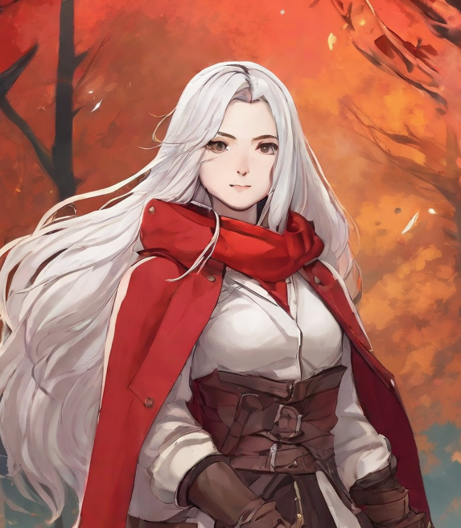
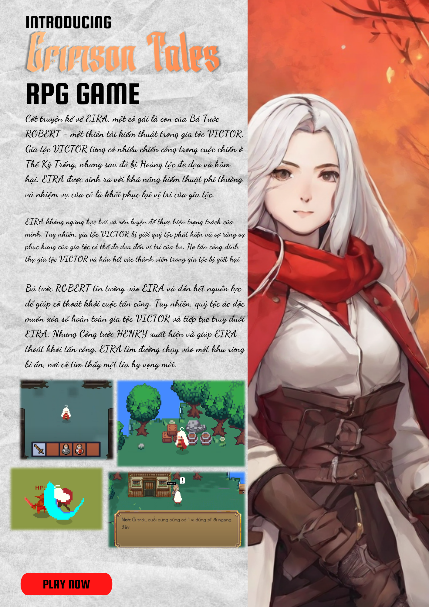

# Crimson Tales

## RPG (Role-playing game)
*RPG (Role-Playing Game)* là thể loại game rất được yêu thích bởi đại đa số
game thủ bởi lối chơi nhập vai cuốn hút với sự đa dạng về vật phẩm, nhiệm
vụ, kẻ thù,... và thường đi theo một hoặc một vài cốt truyện được nhà thiết
kế game cài đặt.

Từ những năm 1970, những viên gạch đầu tiên đặt nền móng cho sự phát
triển của RPG trên các thiết bị điện tử phải kể đến là tựa game Dungeon
(1975), được lấy cảm hứng từ tựa game Dungeons & Dragons - một game
thể loại pen-and-paper RPG được chơi mà không cần các thiết bị điện tử,
cùng với sự phát triển của công nghệ, nhiều thiết bị hỗ trợ chơi game ra đời,
nổi bật trong đó là Gamepad giúp cho việc chơi game dễ tiếp cận và thú vị hơn.

## Mục tiêu của game *Crimson Tales*
*Crimson Tales*, là tựa game mang thể loại RPG được phát triển bởi nhóm
**Dugtrio** với mục tiêu là luyện tập các kiến thức đã học trong môn Phát triển
Game, ngoài ra còn là để các thành viên trong nhóm có cơ hội thỏa niềm
đam mê của mình với lĩnh vực phát triển game.

## Cốt truyện của Crimson Tales
Người chơi vào vai *EIRA*, con gái của Bá tước *ROBERT*, một thiên tài kiếm
thuật và là niềm tự hào của gia tộc *VICTOR*, một gia tộc trung thành, tiên
phong và giành nhiều chiến công trong cuộc chiến ở Thế Kỷ Trống, tuy nhiên
sau đó bị Hoàng tộc hãm hại vì sức mạnh và danh tiếng của gia tộc *VICTOR*
có thể đe dọa tới ngôi vị Hoàng tộc.

Sinh ra với thiên phú về kiếm thuật,
*EIRA* mang trong mình trọng trách khôi phục lại vị trí của gia tộc mình.
Nhận ra trọng trách của mình, *EIRA* không ngừng học tập, rèn luyện bản
thân, dường như sự phục hưng của gia tộc không còn xa nữa. 

Tuy nhiên,
mọi chuyện không dễ dàng như vậy, giới quý tộc đã phát giác được sự thay
đổi này, e sợ trước khả năng một gia tộc hùng mạnh trỗi dậy, họ ra sức phá
hoại gia tộc *VICTOR*, đỉnh điểm là cuộc tấn công thẳng vào dinh thự gia tộc
*VICTOR*, hầu như mọi thành viên trong gia tộc đã bị giết hại. 

Không cam 
lòng để cho niềm hy vọng vừa nhen nhóm lại bị dập tắt, Bá tước *ROBERT*
đã trao tất cả niềm tin vào người con gái của mình và dồn tất cả nguồn lực
còn sót lại để mở đường của *EIRA* chạy trốn. Nhưng không dễ dàng như
vậy, bọn quý tộc ác độc mong muốn xóa sổ hoàn toàn sự hiện diện của gia
tộc *VICTOR* trên thế giới này, bọn họ dồn sức vay hãm dinh thự của gia tộc
*VICTOR*, tưởng chừng như mọi thứ đã kết thúc thì sự xuất hiện của Công
tước *HENRY* đã mở ra một tia hy vọng cho *EIRA*, nhờ sự giúp đỡ của Công
tước *HENRY* mà *EIRA* đã an toàn chạy ra khỏi khu vực tấn công và tiến
vào khu rừng bí ẩn.

## Poster Game

## Gameplay

## Thành viên nhóm Dugtrio
|   MSSV   |            Họ tên               | Profile  
|----------------|-------------------------------|----------------------------
|    20120017    |Phan Quốc Kỳ | [@phanquocky](https://github.com/phanquocky)            
|    20120368    |Nguyễn Minh Tâm | [@tam18902](https://github.com/tam18902)           
|    20120476    |Nguyễn Trọng Hiếu | [@NguyenHiu](https://github.com/NguyenHiu)
|    20120504    |Nhan Gia Khâm | [@Newplayers12](https://github.com/Newplayers12)
