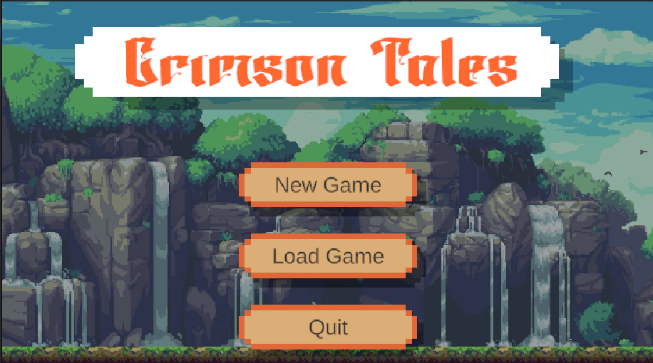

# Crimson Tales

- Category: 2D RPG - Role-Playing Game
- Language: Vietnamese

## Gameplay

## Story line
The player takes on the role of EIRA, the daughter of Count ROBERT, a swordsmanship prodigy and the pride of the VICTOR family, a loyal and pioneering clan that achieved many victories in the War of the Drum Century. However, later on, the VICTOR family falls victim to the machinations of the Royal family due to the power and reputation of the VICTOR clan posing a threat to the royal position.

Born with a natural talent for swordsmanship, EIRA carries the responsibility of restoring her family's status. Recognizing her duty, EIRA tirelessly pursues learning and self-improvement, seemingly bringing the revival of her family's glory closer than ever.

However, things were not as easy as that. The aristocratic circles sensed this change and, fearing the emergence of a powerful family, actively worked to undermine the VICTOR clan. The culmination was a direct assault on the stronghold of the VICTOR family, where almost every member of the clan was slaughtered.

Unwilling to let the flicker of hope be extinguished, Count ROBERT placed all his trust in his daughter and devoted all remaining resources to pave the way for EIRA's escape. Yet, escaping was not as simple as it seemed. The malicious aristocracy, desiring to completely erase the presence of the VICTOR family from the world, relentlessly besieged the clan's stronghold. Just when it appeared that everything had come to an end, the arrival of Duke HENRY brought a glimmer of hope for EIRA. With the assistance of Duke HENRY, EIRA safely fled the attacked area and ventured into the mysterious forest.

<!-- Vietnamese -->
<!-- ## Cốt truyện của Crimson Tales
Người chơi vào vai *EIRA*, con gái của Bá tước *ROBERT*, một thiên tài kiếm
thuật và là niềm tự hào của gia tộc *VICTOR*, một gia tộc trung thành, tiên
phong và giành nhiều chiến công trong cuộc chiến ở Thế Kỷ Trống, tuy nhiên
sau đó bị Hoàng tộc hãm hại vì sức mạnh và danh tiếng của gia tộc *VICTOR*
có thể đe dọa tới ngôi vị Hoàng tộc.

Sinh ra với thiên phú về kiếm thuật,
*EIRA* mang trong mình trọng trách khôi phục lại vị trí của gia tộc mình.
Nhận ra trọng trách của mình, *EIRA* không ngừng học tập, rèn luyện bản
thân, dường như sự phục hưng của gia tộc không còn xa nữa. 

Tuy nhiên,
mọi chuyện không dễ dàng như vậy, giới quý tộc đã phát giác được sự thay
đổi này, e sợ trước khả năng một gia tộc hùng mạnh trỗi dậy, họ ra sức phá
hoại gia tộc *VICTOR*, đỉnh điểm là cuộc tấn công thẳng vào dinh thự gia tộc
*VICTOR*, hầu như mọi thành viên trong gia tộc đã bị giết hại. 

Không cam 
lòng để cho niềm hy vọng vừa nhen nhóm lại bị dập tắt, Bá tước *ROBERT*
đã trao tất cả niềm tin vào người con gái của mình và dồn tất cả nguồn lực
còn sót lại để mở đường của *EIRA* chạy trốn. Nhưng không dễ dàng như
vậy, bọn quý tộc ác độc mong muốn xóa sổ hoàn toàn sự hiện diện của gia
tộc *VICTOR* trên thế giới này, bọn họ dồn sức vay hãm dinh thự của gia tộc
*VICTOR*, tưởng chừng như mọi thứ đã kết thúc thì sự xuất hiện của Công
tước *HENRY* đã mở ra một tia hy vọng cho *EIRA*, nhờ sự giúp đỡ của Công
tước *HENRY* mà *EIRA* đã an toàn chạy ra khỏi khu vực tấn công và tiến
vào khu rừng bí ẩn.

## Gameplay

